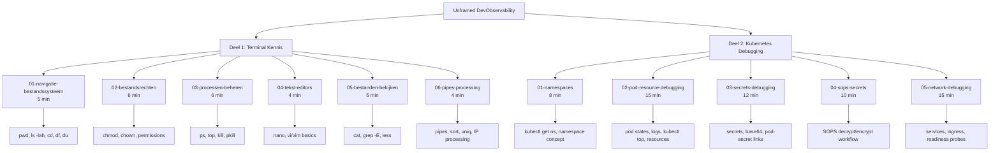
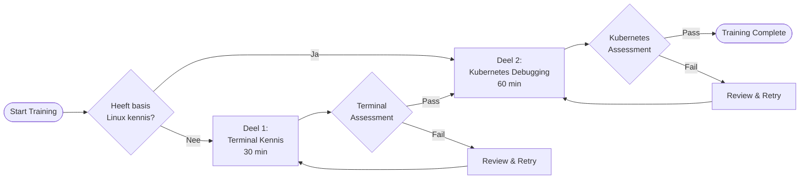

# Project Overzicht - Unframed DevObservability Training

## Projectstructuur

## Tijdsindeling

### Deel 1 - Terminal Kennis (30 minuten totaal)
| Scenario | Tijd | Focus |
|----------|------|-------|
| Navigatie & Bestandssysteem | 5 min | pwd, ls -lah, cd, df, du |
| Bestandsrechten | 6 min | chmod, chown, permissions |
| Processen Beheren | 6 min | ps, top, kill, pkill |
| Tekst Editors | 4 min | nano, vi/vim basics |
| Bestanden Bekijken | 5 min | cat, grep -E, less |
| Pipes & Processing | 4 min | pipes, sort, uniq, IP verwerking |

### Deel 2 - Kubernetes Debugging (60 minuten totaal)
| Scenario | Tijd | Focus |
|----------|------|-------|
| Namespaces | 8 min | kubectl get ns, namespace concept |
| Pod & Resource Debugging | 15 min | pod states, logs, kubectl top, resources |
| Secrets Debugging | 12 min | secrets, base64, pod-secret verbindingen |
| SOPS Secrets | 10 min | SOPS decrypt/encrypt workflow |
| Network Debugging | 15 min | services, ingress, readiness probes |

## Leerpad Flow

## Technische Specificaties

### Backend Requirements
- **Deel 1**: Ubuntu image (`"imageid": "ubuntu"`)
- **Deel 2**: Kubernetes image (`"imageid": "kubernetes-kubeadm-1node"`)

### Pre-setup Requirements
- **Deel 1**: Test bestanden, log data, directory structuren
- **Deel 2**: Kubernetes resources, SOPS configuratie, broken deployments

### Assessment Criteria

#### Deel 1 - Terminal Kennis
- [ ] Kan navigeren door bestandssysteem
- [ ] Begrijpt en kan bestandsrechten aanpassen
- [ ] Kan bestanden bewerken met nano/vi
- [ ] Kan effectief zoeken in bestanden met grep
- [ ] Kan complexe data processing met pipes uitvoeren

#### Deel 2 - Kubernetes Debugging
- [ ] Begrijpt namespace concept en kan navigeren
- [ ] Kan pod problemen diagnosticeren via status en logs
- [ ] Kan secret-pod verbindingen identificeren
- [ ] Kan SOPS gebruiken voor secret management
- [ ] Kan netwerk connectivity issues debuggen

## Implementatie Volgorde

1. **Setup Phase**
   - Verwijder bestaande voorbeeldmappen
   - Creëer deel1/ en deel2/ directory structuur

2. **Deel 1 Implementation**
   - Implementeer alle 5 terminal scenario's
   - Test verificatie scripts
   - Valideer tijdsindeling

3. **Deel 2 Implementation**
   - Implementeer alle 5 Kubernetes scenario's
   - Setup SOPS configuratie
   - Test broken deployment scenarios

4. **Integration Testing**
   - End-to-end test van beide delen
   - Performance en timing validatie
   - User experience testing

## Success Metrics
- **Deel 1**: 90% van cursisten slaagt binnen 30 minuten
- **Deel 2**: 85% van cursisten slaagt binnen 60 minuten
- **Overall**: Praktische vaardigheden direct toepasbaar in productie omgeving

## Onderhoud en Updates
- Maandelijkse review van scenario's
- Update van Kubernetes versies en tools
- Feedback integratie van cursisten
- Nieuwe debugging scenario's toevoegen gebaseerd op productie issues