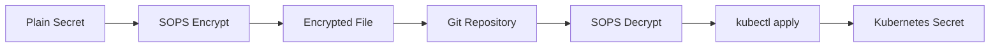

# Stap 1: SOPS Concept en Setup

## SOPS Installatie Verificatie

Laten we controleren of SOPS en Age correct zijn geïnstalleerd:

```plain
sops --version
```{{exec}}

```plain
age --version
```{{exec}}

## SOPS Configuratie Bekijken

Bekijk de SOPS configuratie:

```plain
cat /root/.sops.yaml
```{{exec}}

## Age Key Setup Controleren

Bekijk de Age key configuratie:

```plain
ls -la /root/.config/sops/age/
```{{exec}}

Bekijk de public key (veilig om te delen):

```plain
grep "# public key:" /root/.config/sops/age/keys.txt
```{{exec}}

## Environment Variables

Controleer of de SOPS environment variabele is ingesteld:

```plain
echo $SOPS_AGE_KEY_FILE
```{{exec}}

## Encrypted Secret Files

Bekijk de encrypted secret files die zijn aangemaakt:

```plain
ls -la /root/secrets/
```{{exec}}

## Encrypted vs Plain Secret Vergelijking

Bekijk een encrypted secret file:

```plain
cat /root/secrets/database-secret.yaml
```{{exec}}

Vergelijk met een plain secret:

```plain
cat /root/secrets/plain-secret.yaml
```{{exec}}

## SOPS Metadata Begrijpen

In encrypted files zie je SOPS metadata aan het einde. Dit bevat:
- **mac**: Message Authentication Code voor integriteit
- **age**: Age encryption informatie
- **version**: SOPS versie gebruikt voor encryptie

## Waarom SOPS Beter Is

### Traditionele Kubernetes Secrets:
```yaml
data:
  password: c3VwZXJzZWNyZXQ=  # base64, easily decoded!
```

### SOPS Encrypted Secrets:
```yaml
data:
  password: ENC[AES256_GCM,data:...,tag:...,type:str]
```

## Security Voordelen

1. **Echte Encryptie**: Niet alleen base64 encoding
2. **Git Safe**: Veilig om in Git repositories op te slaan
3. **Selective Encryption**: Alleen waarden encrypted, metadata leesbaar
4. **Key Management**: Geautomatiseerde key rotation
5. **Audit Trail**: Git history toont wijzigingen

## SOPS Workflow Overzicht



## Namespace Setup

Controleer of de SOPS namespace is aangemaakt:

```plain
kubectl get namespace sops
```{{exec}}

Bekijk welke secrets er al zijn:

```plain
kubectl get secrets -n sops
```{{exec}}

## Wat Heb Je Geleerd?

Je hebt nu:
- ✅ SOPS en Age installatie geverifieerd
- ✅ Encryption key setup gecontroleerd
- ✅ Encrypted vs plain secret files vergeleken
- ✅ SOPS metadata structuur begrepen
- ✅ Security voordelen van SOPS geleerd

In de volgende stappen ga je leren hoe je encrypted secrets kunt decrypten, bewerken en toepassen!