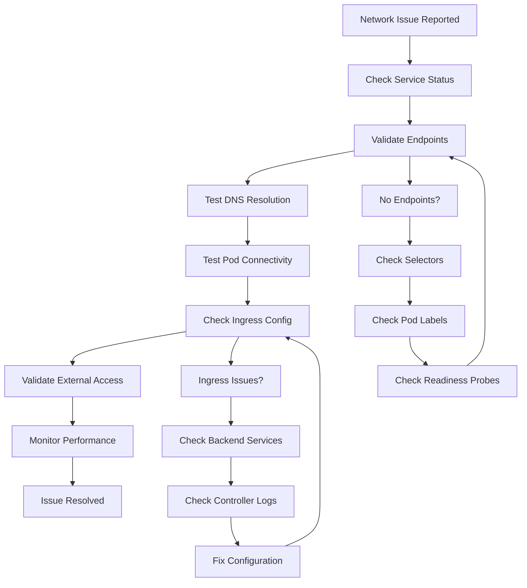

# Gefeliciteerd! 🎉

Je hebt succesvol de Services en Ingress Debugging training voltooid en daarmee het volledige Deel 2 - Kubernetes Debugging afgerond!

## Wat heb je geleerd?

In deze 15 minuten heb je de volgende geavanceerde network debugging vaardigheden ontwikkeld:

### 1. Service Discovery Mastery
- ✅ Begrijpt hoe Kubernetes service discovery werkt via DNS
- ✅ Kunt service types onderscheiden (ClusterIP, NodePort, LoadBalancer)
- ✅ Begrijpt de relatie tussen services, selectors en pod labels
- ✅ Kunt cross-namespace service discovery troubleshooten

### 2. Service Endpoints Debugging
- ✅ Begrijpt hoe endpoints automatisch worden beheerd
- ✅ Kunt service selector problemen identificeren en oplossen
- ✅ Begrijpt de impact van readiness probes op endpoints
- ✅ Kunt handmatige endpoints aanmaken wanneer nodig

### 3. Pod-to-Service Connectivity
- ✅ Beheerst connectivity testing tussen pods en services
- ✅ Begrijpt port mapping (service port vs target port)
- ✅ Kunt load balancing valideren en testen
- ✅ Beheerst directe pod-to-pod communicatie

### 4. Ingress en Load Balancer Debugging
- ✅ Begrijpt ingress controller architectuur
- ✅ Kunt host-based en path-based routing debuggen
- ✅ Beheerst TLS/SSL certificate management in ingress
- ✅ Kunt external access problemen troubleshooten

### 5. Complete Network Troubleshooting
- ✅ Beheerst end-to-end network flow debugging
- ✅ Kunt systematic troubleshooting workflows uitvoeren
- ✅ Begrijpt performance en load testing
- ✅ Kunt network health monitoring implementeren

## Belangrijke Commando's die je nu beheerst:

```bash
# Service discovery
kubectl get services -n <namespace>
kubectl get endpoints -n <namespace>
kubectl describe service <service-name>

# DNS en connectivity testing
kubectl exec <pod> -- nslookup <service>
kubectl exec <pod> -- curl http://<service>
kubectl exec <pod> -- nc -zv <service> <port>

# Ingress debugging
kubectl get ingress -n <namespace>
kubectl describe ingress <ingress-name>
kubectl logs -n ingress-nginx -l app.kubernetes.io/component=controller

# Network troubleshooting
kubectl get events --field-selector involvedObject.kind=Service
kubectl get pods -o wide
kubectl top pods -n <namespace>

# Load balancing en performance
for i in {1..5}; do kubectl exec <pod> -- curl <service>; done
kubectl exec <pod> -- time curl <service>
```

## Complete Network Debugging Workflow:



## Veelvoorkomende Network Problemen die je nu kunt oplossen:

| Probleem | Symptoom | Debugging Stappen | Oplossing |
|----------|----------|-------------------|-----------|
| **Service Discovery Fails** | DNS resolution faalt | Check service exists, DNS config | Fix service name/namespace |
| **No Service Endpoints** | Service unreachable | Check selectors vs pod labels | Fix selector or pod labels |
| **Readiness Probe Fails** | Pods not ready | Check probe config, test endpoint | Fix probe path/port |
| **Ingress Not Working** | External access fails | Check ingress config, controller | Fix backend service config |
| **Load Balancing Issues** | Uneven traffic distribution | Check endpoint distribution | Scale pods, fix readiness |

## Network Debugging Mastery Checklist:

### ✅ **Layer 3 (Network)**
- IP connectivity tussen pods
- DNS resolution binnen cluster
- Cross-namespace communication
- Network policy impact

### ✅ **Layer 4 (Transport)**
- Port connectivity testing
- Service port mapping
- Load balancing validation
- Connection timeouts

### ✅ **Layer 7 (Application)**
- HTTP/HTTPS connectivity
- Host header routing
- Path-based routing
- SSL/TLS termination

## Production-Ready Skills:

### 🔍 **Monitoring**
- Network performance metrics
- Service discovery health
- Ingress controller monitoring
- Connection success rates

### 🛠️ **Troubleshooting**
- Systematic debugging approach
- Root cause analysis
- Performance bottleneck identification
- Capacity planning

### 🔧 **Problem Resolution**
- Service configuration fixes
- Ingress rule corrections
- Readiness probe tuning
- Load balancing optimization

## Deel 2 - Kubernetes Debugging Voltooid! 🚀

Je hebt nu alle 5 scenario's van Deel 2 succesvol voltooid:

1. ✅ **Namespaces** (8 min) - Resource organisatie en isolatie
2. ✅ **Pod Debugging** (15 min) - Status, logs en resource troubleshooting
3. ✅ **Secrets Debugging** (12 min) - Credential management en troubleshooting
4. ✅ **SOPS Secrets** (10 min) - Encrypted secret management
5. ✅ **Network Debugging** (15 min) - Service discovery en connectivity

**Totale tijd: 60 minuten**

## Je bent nu een Kubernetes Debugging Expert!

### 🎯 **Wat je hebt bereikt:**
- Complete Kubernetes troubleshooting workflow mastery
- Production-ready debugging skills
- Security-focused secret management
- Network connectivity expertise
- Real-world problem-solving experience

### 🚀 **Volgende Stappen:**
- Pas deze vaardigheden toe in je eigen projecten
- Implementeer monitoring en alerting
- Ontwikkel geautomatiseerde troubleshooting scripts
- Deel je kennis met je team

### 💡 **Praktische Tips voor de Productie:**
1. **Implementeer monitoring** voordat problemen ontstaan
2. **Documenteer troubleshooting procedures** voor je team
3. **Automatiseer repetitive debugging tasks**
4. **Gebruik GitOps workflows** voor secret management
5. **Train je team** in deze debugging technieken

**Fantastisch werk! Je bent klaar om complexe Kubernetes problemen op te lossen in productie omgevingen! 🎊**