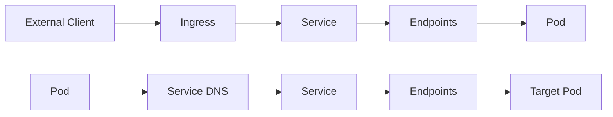

# Services en Ingress Debugging

Welkom bij de Network Debugging training! In dit scenario leer je hoe je network connectivity en service discovery troubleshooting uitvoert in Kubernetes.

## Wat ga je leren?

In de volgende 15 minuten ga je:
- Service discovery en DNS resolution begrijpen
- Service endpoints en selectors debuggen
- Pod-to-service connectivity troubleshooten
- Ingress en load balancer problemen oplossen
- Complete network flow debugging uitvoeren

## Waarom Network Debugging cruciaal is

Network issues zijn een van de meest voorkomende problemen in Kubernetes:
- **Service Discovery**: Pods kunnen services niet vinden
- **Connectivity**: Netwerk verbindingen falen
- **Load Balancing**: Traffic wordt niet correct verdeeld
- **DNS Issues**: Hostname resolution problemen
- **Ingress Problems**: External traffic bereikt pods niet

## Scenario Context

Je werkt als DevOps engineer en er zijn verschillende network problemen gemeld:
- "De frontend kan de backend API niet bereiken"
- "De website is niet toegankelijk van buitenaf"
- "Database connecties falen intermittent"
- "Load balancing werkt niet correct"

Het cluster is voorbereid met verschillende services, ingress controllers en opzettelijke network problemen. Jouw taak is om deze problemen te identificeren en op te lossen.

## Kubernetes Network Components

Je gaat werken met:
- **Services**: ClusterIP, NodePort, LoadBalancer
- **Endpoints**: Automatische pod discovery
- **Ingress**: HTTP/HTTPS routing naar services
- **DNS**: Service discovery via DNS
- **Network Policies**: Traffic filtering (indien aanwezig)

## Veelvoorkomende Network Problemen

### Service Discovery Issues:
- Verkeerde service selectors
- Pods zonder juiste labels
- DNS resolution problemen
- Service in verkeerde namespace

### Connectivity Problems:
- Network policies blokkeren traffic
- Firewall regels
- Pod readiness probe failures
- Service port mismatches

### Ingress Issues:
- Verkeerde backend configuratie
- SSL/TLS certificate problemen
- Host header mismatches
- Ingress controller problemen

## Network Flow in Kubernetes

 

**Laten we beginnen met network debugging!**