# Network Debugging: Extern naar Pod

Welkom bij de Network Debugging training! In dit scenario leer je hoe je systematisch network problemen debugt door de complete flow te volgen: **Extern → Ingress → Service → Pod**.

## Wat ga je leren?

In de volgende 15 minuten ga je:
- De network flow van extern naar pod begrijpen
- Systematisch debuggen van elke stap in de flow
- Veelvoorkomende problemen identificeren en oplossen
- End-to-end connectivity valideren

## Waarom deze aanpak werkt

Network debugging kan overweldigend zijn, maar door de flow systematisch te volgen wordt het veel eenvoudiger:

```
🌐 External Client → 🚪 Ingress → ⚖️ Service → 🎯 Pod
```

Elk onderdeel heeft specifieke problemen die je kunt identificeren en oplossen.

## Scenario Context

Je krijgt een melding: **"De website is niet bereikbaar van buitenaf!"**

Dit is een klassiek network probleem dat je gaat oplossen door systematisch elke stap te controleren:

1. **Extern → Ingress**: Kan traffic de ingress bereiken?
2. **Ingress → Service**: Routeert ingress naar de juiste service?
3. **Service → Pod**: Heeft de service werkende endpoints?
4. **End-to-end**: Werkt de complete flow?

## Network Flow Debugging

```mermaid
graph LR
    A[🌐 External Client] --> B[🚪 Ingress Controller]
    B --> C[⚖️ Service]
    C --> D[🎯 Pod]
    
    style A fill:#e1f5fe
    style B fill:#f3e5f5
    style C fill:#e8f5e8
    style D fill:#fff3e0
```



### Debugging Strategie:
- **🔍 Identificeer** waar de flow breekt
- **🔧 Repareer** het specifieke probleem
- **✅ Valideer** dat de fix werkt
- **🔄 Herhaal** voor de volgende stap

## Veelvoorkomende Problemen per Stap

### 🚪 Ingress Problemen:
- Ingress controller niet running
- Verkeerde host configuratie
- Backend service bestaat niet

### ⚖️ Service Problemen:
- Service heeft geen endpoints
- Verkeerde selector configuratie
- Port mismatch

### 🎯 Pod Problemen:
- Pods zijn niet ready
- Readiness probe faalt
- Verkeerde labels

<br>

**Laten we systematisch beginnen met network debugging!**